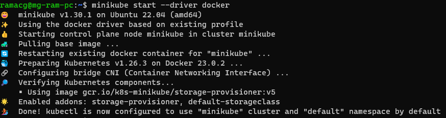
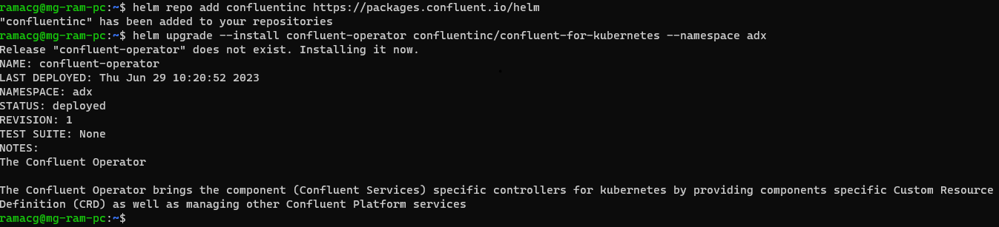
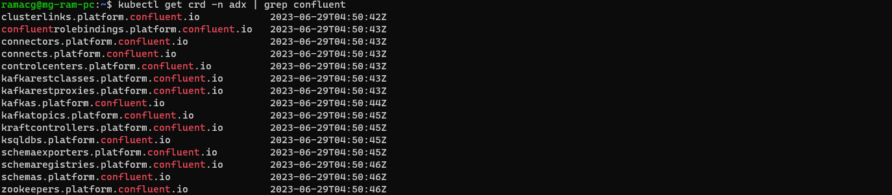

#### Quickstart ####

The quickstart is intended as a developer bootstrapping guide to quickly get you up and running with Kafka and the Kusto ADX connector 
on a developer machine set up. This can be extended for deployment on a Kubernetes cluster with necessary changes in the
configuration suiting production. The example uses a simple Strimzi cluster, that can be changed to Confluent Kafka as well.

It will walk you through the following steps:

#### Pre-requisites ####
The following are the pre-requisites to be installed for the quickstart to work:
kubectl - https://kubernetes.io/docs/tasks/tools/install-kubectl/
Helm    - https://helm.sh/docs/intro/install/
Minikube - https://minikube.sigs.k8s.io/docs/start/
#### Optional ####
Docker - https://docs.docker.com/get-docker/

#### Step 1: Create a Kubernetes cluster ####
The command, minikube start, starts by downloading the boot image and starting the VM. Note: is necessary to 
specify which VM driver will be used by Minikube in our example is used Docker if you want to use another driver you 
can do doing the following command:

```bash
minikube start --driver docker
```


### Step 2: Create a namespace ###

```bash
kubectl create ns kafka
```

### Step 3: Install the ADX connector ###

```bash
kubectl create ns adx
kubectl config set-context --current --namespace adx
helm repo add confluentinc https://packages.confluent.io/helm
helm upgrade --install confluent-operator confluentinc/confluent-for-kubernetes --namespace adx
```



```bash
kubectl get crd | grep confluent
```


There are 2 key resources here, kafkas.platform.confluent.io which represents Kafka clusters in Kubernetes. 
We will focus on connects.platform.confluent.io and connectors.platform.confluent.io which represent 
Kafka Connect clusters and Connectors.
