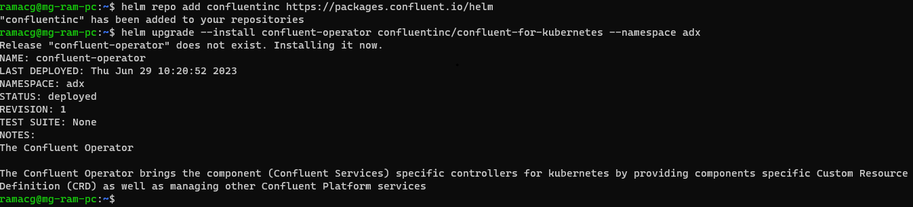

#### Quickstart ####

The quickstart is intended as a developer bootstrapping guide to quickly get you up and running with Kafka and the Kusto ADX connector 
on a developer machine set up. This can be extended for deployment on a Kubernetes cluster with necessary changes in the
configuration suiting production. The example uses a confluent operator to deploy Kafka and Kafka connect on a minikube cluster.

It will walk you through the following steps:

#### Pre-requisites ####
The following are the pre-requisites to be installed for the quickstart to work:
kubectl - https://kubernetes.io/docs/tasks/tools/install-kubectl/
Helm    - https://helm.sh/docs/intro/install/
Minikube - https://minikube.sigs.k8s.io/docs/start/
#### Optional ####
Docker - https://docs.docker.com/get-docker/

#### Step 1: Create a Kubernetes cluster ####
The command, minikube start, starts by downloading the boot image and starting the VM. Note: is necessary to 
specify which VM driver will be used by Minikube in our example is used Docker if you want to use another driver you 
can do doing the following command:

```bash
minikube start --driver docker
```


### Step 2: Create a namespace ###
```bash
kubectl create ns adx
```
### Step 3: Set up tables in the ADX cluster ###
Create the tables in ADX 
```kql
.add database kafka ingestors ('aadapp=<app-id>;<tenant/authority-id>')
.create table PageViews(viewtime:int, userid:string,pageid:string)
.alter table PageViews policy ingestionbatching @'{"MaximumBatchingTimeSpan":"00:00:05", "MaximumNumberOfItems": 100, "MaximumRawDataSizeMB": 100}'
```

### Step 4: Install the ADX connector ###
```bash
kubectl create ns adx
kubectl config set-context --current --namespace adx
helm repo add confluentinc https://packages.confluent.io/helm
helm upgrade --install confluent-operator confluentinc/confluent-for-kubernetes --namespace adx
```


```bash
kubectl get crd | grep confluent
```


There are 2 key resources here, kafkas.platform.confluent.io which represents Kafka clusters in Kubernetes. 
We will focus on connects.platform.confluent.io and connectors.platform.confluent.io which represent 
Kafka Connect clusters and Connectors.


Open the config file [cp-kafka-connect.yaml](manifest/cp-kafka-connect.yaml) and make the changes corresponding to the
set up you for the target environment. The following properties need to be changed to suit your environment:

| Property           | Description                                      |
|--------------------|--------------------------------------------------|
| Topic to subscribe | Name of the topic to produce and consume results |
| Target DB          | Target database in ADX to write the data to      |
| Target Table       | Target table in ADX to write the data to         |
| Ingest URL         | Ingestion endpoint of the ADX cluster            |
| Query URL          | Endpoint of the ADX cluster                      |     
| AAD Auth App id    | AAD Service principal id                         |
| AAD Auth App key   | AAD Service principal auth key                   |
| AAD Auth Authority | AAD Tenant/Authority Id                          |


### Step 5: Deploy the connector ###

Once the resources are set up, use the manifest files to create and deploy the connector the Kafka Connect cluster.
```bash
kubectl create -f cp-kafka-base.yaml
kubectl create -f cp-kafka-connect.yaml
```
Applying the manifest should create the resources and deploy the Kafka cluster, Zookeeper, Kafka connect clusters 


For the pods to run it will take a few minutes.Wait for all the pods to be in running state


### Step 6: Validate data ###
Login into the kafka pod and validates that messages ar being produced to the configured topic

```bash
kubectl exec -it kafka-0 -c kafka -- /bin/bash
/usr/bin/kafka-console-consumer --bootstrap-server kafka-0.kafka-headless.kafka.svc.cluster.local:9092 --topic json.pageviews.topic --from-beginning --max-messages 10
````


The sample data produced should make it to the ADX cluster. You can check the data in the ADX cluster using the following query:

```kql
.show commands-and-queries | where CommandType == "DataIngestPull" and Database == "kafka" and LastUpdatedOn >= ago(15m) | order by LastUpdatedOn desc
PageViews | take 100
```


